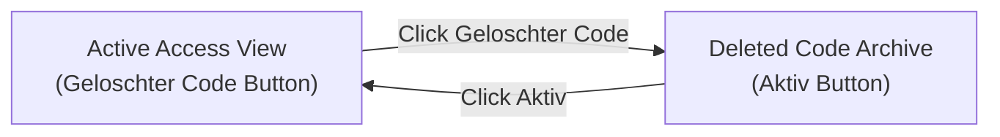

The **Access Management** page (labeled **Gerätezugang (Zugangsverwaltung)** in the platform) is the central security control center in SUITEe. From here, property operators can issue digital keys and numeric PIN codes for guests, staff, and maintenance contractors, monitor real-time lock synchronization, and inspect deleted credentials for security compliance.

Navigate to this page at:

```
https://hotel.suite-e.com/device-access
```

---

## Page overview

<Frame>
  
</Frame>

### Header and core controls

- **Title & Subtitle**: The page heading reads **Gerätezugang (Zugangsverwaltung)** with the subtitle *Gerätezugang für Ihre Immobilie verwalten* (Manage device access for your property). An info tooltip **ⓘ** provides guidance on access credential management.
- **Top-Right View Toggle**: By default, this shows the orange **`Gelöschter Code`** button, allowing you to toggle between live active credentials and the deleted code archive.
- **Add Credentials Button (`+ Zugangsdaten hinzufügen`)**: The primary action button located on the right side of the filter bar. Clicking it opens the credential creation modal to generate new PIN codes or digital keys for guests and staff.

---

## Active vs. deleted code toggle workflow

SUITEe separates active credentials from deleted codes to keep operational lists clean while retaining an immutable audit trail for security and insurance compliance.

You can switch between these two views seamlessly using the toggle button in the upper-right corner:



---

### Step 1 — Clicking `Gelöschter Code` to view deleted archives

In the active view, the orange button in the top-right corner displays **`Gelöschter Code`**:

<Frame>
  
</Frame>

When you click this button, the interface immediately switches from the active access feed into the **Deleted Code Archive**:

<Frame>
  
</Frame>

#### Purpose of the deleted code archive

- **Security & Compliance Auditing**: Even after a PIN code or mobile key has been revoked or deleted (e.g. after early check-out, cancellation, or staff departure), its complete audit history is preserved.
- **Investigation Trail**: If an unauthorized entry or incident is investigated, operators can verify who originally created the code, when it was valid, which smart lock it was assigned to, and when it was deleted.
- **Dedicated Archive View**: The status tabs are hidden in this view because all entries represent historical, non-active credentials.

---

### Step 2 — Clicking `Aktiv` to return to live access management

While inside the Deleted Code archive, the top-right button changes to display **`Aktiv`**:

<Frame>
  
</Frame>

Clicking the **`Aktiv`** button immediately returns you to the live **Active Access Management** table:

<Frame>
  
</Frame>

In this active view, all real-time operational tabs and active credentials return, ready for day-to-day access control.

---

## Filtering and search controls

Above the table, a comprehensive toolbar lets operators quickly locate, filter, and audit credentials across large property portfolios.

---

### Filter dropdown (`Filtern nach`)

Clicking the **Filtern nach** (Filter by) dropdown opens a structured filter criteria menu equipped with an integrated search filter:

<Frame>
  
</Frame>

#### Internal search input (`Q Suche`)

At the top of the opened dropdown is a dedicated search input with the placeholder **`Suche`** (highlighted with an active orange border). When operating across large properties with dozens of filter tags, administrators can type directly into this field to instantly narrow down the available criteria options without scrolling.

#### Available filter criteria

The dropdown categorizes access credentials across four core dimensions:

| Criterion | Purpose | Operational Use Case |
| :--- | :--- | :--- |
| **Erstellt von** | Filter by Creator | Isolate credentials created by a specific hotel staff member (e.g. `Kallola Bal`) or via automated third-party PMS booking integrations. |
| **Immobilie** | Filter by Property | For hospitality groups managing multiple locations, select a specific property or building to restrict the access feed. |
| **Wert** | Filter by Credential Value | Search for a specific numeric PIN code string, keycard chip UID, or digital token value directly. |
| **Zimmer** | Filter by Room / Unit | Narrow the table down to credentials programmed for a specific unit (e.g. `UNIT-3`, `UNIT-5`). Cross-linked to [Rooms](/dashboard/rooms). |

---

### Validity date picker (`Gültigkeitszeitraum wählen`)

The calendar picker input allows you to specify an exact validity window (`Zeitraum auswählen`):

- **Filter by Stay Window**: View all access codes valid during a specific weekend, month, or event timeframe.
- **Conflict Prevention**: Verify overlapping access permissions before assigning temporary maintenance codes to occupied rooms.

---

### Search bar and toolbar controls (`Suche`)

The search bar provides a high-speed, multi-field search engine positioned alongside quick-action toolbar buttons:

<Frame>
  
</Frame>

#### Multi-field search functionality

The search input features the placeholder:

```
Suche nach Immobilie, Zimmername, Erstellt von, Benutzername
```

Unlike basic single-column search inputs, this 4-in-1 query engine evaluates four distinct database attributes simultaneously:

1. **Property Name (`Immobilie`)**: Type the building or property name to locate all associated credentials across units.
2. **Room Name (`Zimmername`)**: Instantly isolate credentials for a specific room or apartment (e.g. typing `UNIT-3` or `102`).
3. **Creator (`Erstellt von`)**: Search by the administrator name, manager username, or PMS service account that provisioned the code.
4. **Recipient / Username (`Benutzername`)**: Search by guest name, reservation reference number, staff member ID, or contractor name (e.g. `test-890`, `Test-99012`).

#### Search behavior and live filtering

- **Real-Time Filtering**: The table updates dynamically as you type each keystroke, immediately trimming non-matching rows.
- **Case-Insensitive Matching**: Queries match regardless of capitalization (e.g. `unit-3`, `Unit-3`, and `UNIT-3` return identical results).
- **Sub-String Matching**: Typing partial values (e.g. `901`) matches both `Test901` and `TEST9001`.

---

### Refresh button (`↻`)

Positioned immediately to the right of the search input is the circular refresh icon **`↻`**:

- **Instant Telemetry Re-Query**: Clicking **`↻`** polls the physical IoT gateways and lock network to retrieve the latest credential sync flags, door programming confirmations, and error statuses.
- **No Page Reload Required**: Telemetry is updated in-place via WebSocket/REST background calls without resetting active filter dropdowns or table pagination.

---

### Add credentials button (`+ Zugangsdaten hinzufügen`)

The prominent orange button on the far right launches the credential creation wizard:

- Allows operators to generate time-restricted numeric PIN codes or encode physical RFID/NFC keycards for upcoming guests, staff members, or maintenance contractors.

---

## Status tabs and live table data

The five status tabs at the top of the table act as live status filters. Clicking each tab updates the table to display credentials matching that specific lifecycle state.

---

### Tab 1 — Successfully created (`Erstellt (0)`)

The **Erstellt** tab displays credentials that are currently active, verified, and programmed into physical smart locks.

<Frame>
  
</Frame>

- **Current Count (`0`)**: When no active guests are currently checked in and no ongoing staff PINs are active, the table displays **`Keine Daten verfügbar`** (No data available).
- **When Data Appears**: As soon as a guest completes digital check-in or an operator creates a valid PIN, it appears here in real time with an active status badge.

---

### Tab 2 — Partially created (`Teilweise erstellt (0)`)

The **Teilweise erstellt** tab tracks multi-door access credentials that have only partially completed synchronization.

<Frame>
  
</Frame>

- **Multi-Door Provisioning**: In properties with common area doors (e.g. main building entrance, elevator, gym, and private room door), SUITEe pushes the credential to multiple hardware locks simultaneously.
- **Partial State**: If the entrance lock successfully syncs but the private room lock is momentarily delayed or experiencing weak RF signal, the credential is categorized as partially created until all locks confirm synchronization.

---

### Tab 3 — Expired credentials (`Abgelaufen (4)`)

The **Abgelaufen** tab contains credentials whose validity period has elapsed.

<Frame>
  
</Frame>

This view displays 4 expired PIN credentials with complete audit records:

- **Interactive PIN Display (`Passwort`)**:
  - Masked by default as `*****` for confidentiality.
  - **Eye Icon (`👁`)**: Clicking reveals the cleartext numeric PIN.
  - **Copy Icon (`❐`)**: Clicking copies the PIN directly to the clipboard to share with the guest or staff member.
- **Credential Type (`Typ: PIN`)**: Confirms this access credential was a numeric keypad PIN code.
- **Room Badge (`Zimmer: UNIT-3`)**: Highlights the assigned unit in an orange badge, linked to [Rooms](/dashboard/rooms).
- **Device Badge (`Geräte: Room Door Lock EN`)**: Highlights the specific electronic lock programmed with this PIN, linked to [Devices](/dashboard/devices).
- **Status Badge (`Zugangsstatus: Abgelaufen`)**: A red pill badge confirming the lock has purged or disabled the code.
- **Creator (`Erstellt von: Kallola Bal`)**: Records the staff member who generated the PIN.
- **Validity Timeframe (`Gültig ab` / `Läuft ab am`)**: Shows exact start and expiration dates and times (e.g. `17 Sep 2026 11:58 (IST)` to `18 Sep 2026 11:57 (IST)`).

---

### Tab 4 — Failed synchronizations (`Fehlgeschlagen (3)`)

The **Fehlgeschlagen** tab flags credentials that failed to synchronize with the target lock hardware.

<Frame>
  
</Frame>

This view displays 3 failed credentials and highlights key behavioral differences between PINs and physical cards:

- **Password Displays Hyphen (`-`)**: In rows where `Typ` is **`CARD`** (e.g. `Test-99012`, `TEST9001`), the `Passwort` column displays **`-`**. Physical RFID/NFC keycards operate via cryptographic UID card chips and do not have a numeric PIN password.
- **Validity Columns Display Hyphen (`-`)**: Because the initial sync to the lock failed, the access validity window was never activated on the hardware.
- **Creation Timestamp (`Erstellt am`)**: Displays the exact creation attempt timestamp (e.g. `17 Sep 2026 11:44 (IST)`).
- **Troubleshooting Failed Syncs**:
  - Verify that the target lock is online in [Devices](/dashboard/devices).
  - Inspect the lock's battery level — low batteries prevent OTA radio transceivers from accepting new card encodings.
  - Ensure the IoT gateway is reachable and within RF range of the lock.

---

### Tab 5 — Full combined view (`Alle (7)`)

The **Alle** tab aggregates all access credentials across all statuses into one unified table view (`0 + 0 + 4 + 3 = 7`).

<Frame>
  
</Frame>

The combined view illustrates how SUITEe manages heterogeneous credential types side-by-side:

| Row Example | Username | Password | Type | Room | Device | Status | Creator | Validity |
| :--- | :--- | :--- | :--- | :--- | :--- | :--- | :--- | :--- |
| **Row 1** | `test-890` | `*****` 👁 ❐ | `PIN` | `UNIT-3` | `Room Door Lock EN` | `Abgelaufen` | `Kallola Bal` | 17 Sep – 18 Sep 2026 |
| **Row 2** | `Test-99012` | `-` | `CARD` | `UNIT-3` | `Room Door Lock EN` | `Fehlgeschlagen` | `Kallola Bal` | `-` |
| **Row 3** | `Test901` | `*****` 👁 ❐ | `PIN` | `UNIT-3` | `Room Door Lock EN` | `Abgelaufen` | `Kallola Bal` | 17 Sep – 20 Sep 2026 |

---

## Detailed table column definitions

Every column in the Access Management table serves a specific operational purpose:

| Column | Sortable | Description & Interactive Features |
| :--- | :---: | :--- |
| **Benutzername** | **`⇅`** | The identifier of the credential recipient (e.g. guest name, staff ID, or reservation code). Click column header arrows to sort alphabetically. |
| **Passwort** | — | Displays the security code. For **PIN** credentials, it is masked with `*****` and includes an **Eye Icon (`👁`)** to unmask and a **Copy Icon (`❐`)** to copy to clipboard. For **CARD** credentials, it displays **`-`**. |
| **Typ** | **`⇅`** | The hardware access method: **PIN** (keypad numeric entry) or **CARD** (contactless RFID / NFC keycard). |
| **Zimmer** | — | The room or unit where access is granted, formatted as an orange badge (e.g. `UNIT-3`). Linked to [Rooms](/dashboard/rooms). |
| **Geräte** | — | The physical smart lock hardware programmed with this code (e.g. `Room Door Lock EN`). Linked to [Devices](/dashboard/devices) and [Smart Locks](/devices/smart-locks). |
| **Zugangsstatus** | **`⇅`** | Real-time status badge: **Erstellt** (Active), **Teilweise erstellt** (Partial sync), **Abgelaufen** (Expired), or **Fehlgeschlagen** (Sync failed). |
| **Erstellt von** | **`⇅`** | The user or system account that generated the credential (e.g. `Kallola Bal` or automated PMS sync). |
| **Gültig ab** | **`⇅`** | The starting date and time when the credential activates on the lock (displayed with local timezone, e.g. `IST`). |
| **Läuft ab am** | **`⇅`** | The expiration date and time when the credential ceases to function and is revoked from the lock. |
| **Erstellt am** | **`⇅`** | The exact creation timestamp when the credential was requested in SUITEe. |
| **Aktion** | — | Action controls to edit validity parameters, resend code credentials to guests, or revoke/delete access immediately. |

---

## Creating new credentials (`+ Zugangsdaten hinzufügen`)

To manually issue access permissions for a guest, staff member, or service technician, click the orange **`+ Zugangsdaten hinzufügen`** button located on the right side of the toolbar:

<Frame>
  
</Frame>

Clicking this button launches the **Zugangsdaten hinzufügen** (Add access credentials) modal wizard. The modal is organized into a four-step configuration form on the left and a live, dynamic **Zusammenfassung** (Summary) card on the right that recalculates permissions in real time.

You can create two distinct types of credentials: **Numeric PIN Codes (`PIN`)** and **Physical RFID Keycards (`Karte`)**.

---

### Option 1 — Creating numeric PIN credentials (`PIN`)

Selecting the **PIN** option generates a numeric code that users enter directly into the physical keypad of smart door locks.

#### Steps 1 & 2 — Access method and door coverage

<Frame>
  
</Frame>

- **Step 1 — Access Method (`1 Zugangsart`)**:
  - Click the **`PIN`** toggle button (identified with a numeric keypad dots icon).
- **Step 2 — Access Area (`2 Zugangsbereich`)**:
  - **Property (`Immobilie`)**: Pre-selected to the currently active property (e.g. `Property No-PMS`).
  - **Room Selection (`Zimmer *`)**: Multi-select dropdown (`Zimmer auswählen` — *Wählen Sie ein oder mehrere Zimmer*). Select one or multiple rooms that this credential should open. Linked directly to [Rooms](/dashboard/rooms).
  - **Include Main Entrance (`Haupteingang einschließen`)**:
    - A toggle switch accompanied by the explanation: *Ermöglicht zusätzlich zu den ausgewählten Zimmern den Zugang über den Gebäudeeingang.* (Allows access via the building entrance in addition to the selected rooms).
    - When enabled, SUITEe automatically syncs the same PIN to both the building's exterior perimeter/lobby door lock and the private room lock, giving guests frictionless entry from the street all the way to their room.

#### Steps 3 & 4 — Validity period and PIN generation

<Frame>
  
</Frame>

- **Step 3 — Validity (`3 Gültigkeit`)**:
  - **Valid From (`Gültig ab (IST) *`)**: Set to **`Jetzt`** (Now) to activate the code immediately upon creation, or pick a scheduled future check-in date and time.
  - **Expires At (`Läuft ab am (IST) *`)**: Select an expiration timestamp. You can click a date directly or select one of five quick-duration presets:
    - **`1 Tag`** (24 hours — ideal for day guests or maintenance technicians)
    - **`3 Tage`** (Weekend stays)
    - **`1 Woche`** (7-day reservations)
    - **`1 Monat`** (Extended stay or temporary staff)
    - **`Benutzerdefiniert`** (Custom date and time picker)
- **Step 4 — Access Data (`4 Zugangsdaten`)**:
  - **Guest / Username (`Gast / Benutzername *`)**: Required text field to specify the recipient's name or reservation reference.
  - **Custom PIN (`Benutzerdefinierte PIN (optional)`)**:
    - Enter exactly 6 digits, or leave blank.
    - If left blank, SUITEe's cryptographic key generator automatically produces a secure, non-sequential 6-digit random PIN.
    - An **eye toggle (`👁`)** allows you to verify the digits before submission.
- **Live Summary (`Zusammenfassung`)**:
  - Displays a green confirmation badge: **`✓ Automatisch generiert`** (or your custom 6-digit code) and verifies that credentials will be provisioned with the selected permissions.
- **Submitting**: Clicking the orange **`Zugangsdaten erstellen`** button immediately transmits the encrypted PIN code to the selected door locks via their connected gateways.

---

### Option 2 — Encoding physical keycards (`Karte`)

Selecting the **Karte** option encodes physical contactless RFID / NFC keycards using an attached desk encoder station.

#### Steps 1 & 2 — Selecting card reader and door coverage

<Frame>
  
</Frame>

- **Step 1 — Access Method (`1 Zugangsart`)**:
  - Click the **`Karte`** toggle button (identified with a credit card icon).
  - **Card Reader Dropdown (`Kartenleser *`)**:
    - A dedicated field labeled **`Kartenleser auswählen`** appears immediately below the toggle.
    - Operators must select which reception desk USB or network card encoder will write the physical RFID badge.
- **Step 2 — Access Area (`2 Zugangsbereich`)**:
  - Select the property, assign one or multiple rooms, and optionally enable the **`Haupteingang einschließen`** switch to grant main entrance gate pass-through.

#### Steps 3 & 4 — Card validity and cardholder assignment

<Frame>
  
</Frame>

- **Step 3 — Validity (`3 Gültigkeit`)**:
  - Configure the activation timestamp and expiration duration using the same quick presets (`1 Tag`, `3 Tage`, `1 Woche`, `1 Monat`, or `Benutzerdefiniert`).
- **Step 4 — Access Data (`4 Zugangsdaten`)**:
  - Enter the **`Gast / Benutzername *`**.
  - **No PIN Field Required**: Notice that the *Benutzerdefinierte PIN* input is automatically hidden. Physical RFID cards communicate cryptographically via contactless chip UIDs and do not require numeric keypad passwords.
- **Live Summary (`Zusammenfassung`)**:
  - Reflects the card mode with a green **`✓ Karte`** badge.
- **Submitting**: Clicking **`Zugangsdaten erstellen`** prompts the operator to place an RFID card on the selected reader station to write the access token and register the card UID in the property's smart locks.

---

### Comparison: PIN vs. Keycard workflow

| Feature | PIN Credential (`PIN`) | Physical Keycard (`Karte`) |
| :--- | :--- | :--- |
| **Required Hardware** | Keypad-equipped smart door lock | RFID/NFC smart lock + Reception Card Reader |
| **Additional Equipment** | None | Desk card encoder (`Kartenleser *`) |
| **Password Input** | Auto-generated or custom 6-digit PIN | No PIN; physical encrypted contactless chip UID |
| **Delivery Method** | SMS, Email, WhatsApp, or verbal code | Physical card handed to guest at check-in |
| **Building Entrance** | Same PIN unlocks main entrance gate | Same card taps to unlock main entrance reader |
| **Table Password Display** | Displayed as `*****` (with `👁` and `❐`) | Displayed as `-` (no numeric password) |

---

## Interconnected dashboard modules

Access Management connects with every operational layer of the property:

- **[Devices](/dashboard/devices)**: Smart door locks managed in the Devices module receive the PIN codes and credentials generated here.
- **[Rooms](/dashboard/rooms)**: Rooms configured in the Rooms module define the door assignments for all credentials.
- **[Booking](/dashboard/booking)**: Automated guest journeys in the Booking module trigger automatic credential creation at check-in time.
- **[Activity Centre](/dashboard/activity-centre)**: Every successful unlock, invalid PIN attempt, and code synchronization event is logged in the activity feed.
- **[Smart Locks](/devices/smart-locks)**: Hardware specifications and technical documentation for the electronic door locks programmed through this interface.
